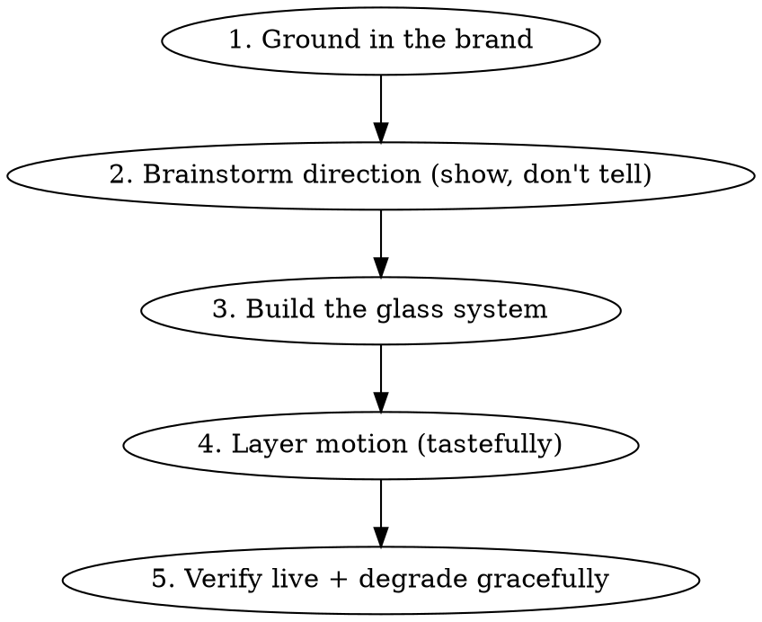

# modern-style-design — Skill (inbox copy)

> Canonical location: C:\Users\Oskari\.claude\skills\modern-style-design\
> Flattened record copy per the markdown-routing rule. Edit the canonical files, not this.

---

## SKILL.md

---
name: modern-style-design
description: >
  Use this skill whenever the user wants to design, revamp, modernise, or "make
  cooler/sleeker/more premium" a website, landing page, or web UI — especially when
  they mention "liquid glass", "glassmorphism", "frosted glass", "modern style",
  "Apple-style", "aurora/mesh gradient", "make it pop", "give it a glow up", or want
  a current 2025/2026 aesthetic. ALSO use it when revamping an existing site where the
  brand colours must be kept but the styling completely refreshed. It supplies a
  production-ready, vanilla-CSS liquid-glass design system, a motion/micro-interaction
  layer, a palette-preservation method, and a browser-based visual brainstorming flow
  for letting the user pick direction. Reach for this even if the user doesn't say the
  word "glass" — any "make this look modern / high-end" frontend request qualifies.
---

# Modern-Style Web Design (Liquid Glass)

Design distinctive, current, premium web interfaces — most often in the **Apple
"Liquid Glass" (2025)** language: frosted translucent panels floating over soft
coloured light, rim-light edges, gentle depth, and restrained motion. The aim is
work that looks like a thoughtful 2026 studio made it, not a generic template.

This skill is **flexible**, not rigid. The recipes are a strong starting point;
adapt them to the brand and the content. Taste is the point — don't bolt every
effect onto every element.

## When this applies

Any request to make a site/page/component look modern, premium, sleek, "glassy",
or to revamp an existing design. The signature move here is **liquid glass**, but
the method (research current style → preserve brand → apply a coherent system →
add a tasteful motion layer → verify live) works for any modern aesthetic.

## The method (follow in order)



### 1. Ground in the brand (never skip)

If revamping an existing site, **extract and preserve the colour profile and
type** before touching anything. The brand should still be recognisable — same
soul, new clothes. Read `references/palette-preservation.md` for how to pull the
exact tokens out of the current CSS and keep them. Changing a brand's colours
during a "revamp" is the most common way to make the user feel you broke their
identity. Keep the palette; change everything else.

### 2. Brainstorm direction — show, don't tell

Design choices are visual; a user cannot judge "liquid glass vs aurora editorial"
from prose. **Show live mockups in the brand's real colours and let them pick.**
The most effective tool is the browser-based visual companion (from the
`brainstorming` skill) — push 2–4 real CSS mockups of the hero, have the user
click one, then iterate (intensity, then motion). See
`references/visual-brainstorming.md` for the exact 3-step flow
(style direction → glass intensity → motion layer) that works well here, including
ready-to-adapt comparison-screen scaffolding.

If a visual companion isn't available, fall back to building one strong hero
mockup and screenshotting it, or describe 2–3 directions crisply and recommend one.
Either way: **decide direction with the user before building the whole page.**

### 3. Build the glass system

Liquid glass done well looks premium; done cheaply it looks like 2021 frosted
glass. The difference is in the details — saturation boost, a rim-light highlight,
layered shadows, and *light behind the glass to refract*. Read
`references/glass-recipes.md` for the full production cookbook. The essentials:

**One reusable material**, not ad-hoc blur on each element:
```css
:root{
  --glass-bg: rgba(255,255,255,0.06);              /* tint of your light text colour, low alpha */
  --glass-border: rgba(255,255,255,0.14);
  --glass-rim: inset 0 1px 1px rgba(255,255,255,0.16);  /* the rim light — do not skip */
  --glass-blur: blur(18px) saturate(150%) brightness(1.06);
}
.glass{
  background: var(--glass-bg);
  -webkit-backdrop-filter: var(--glass-blur);   /* -webkit- prefix is mandatory for Safari */
  backdrop-filter: var(--glass-blur);
  border: 1px solid var(--glass-border);
  box-shadow: var(--glass-rim), 0 10px 30px rgba(0,0,0,.4);
}
```

**Put light behind the glass.** Glass refracting a flat colour looks dead. Add a
fixed background layer of slow-drifting radial-gradient "blooms" in the brand's
accent colours, plus a faint SVG film-grain overlay. This is what makes the blur
read as *glass* rather than *grey box*. Full snippets in the cookbook.

**Calibrate the dose.** Glass on everything is heavy and can hurt readability.
Typically: glass nav + glass cards at moderate blur, with the hero text legible.
Let the user choose subtle / balanced / immersive (step 2 covers this).

**Accent with the brand, glow sparingly.** A single accent colour for a featured
card's border + a soft `0 0 24px` glow goes a long way. Don't glow everything.

### 4. Layer motion — tastefully

Modern ≠ busy. A few well-chosen micro-interactions make a page feel alive;
too many make it feel like a demo reel. The cookbook has vanilla, no-library
implementations of: scroll-reveal (native `animation-timeline` or
IntersectionObserver), magnetic buttons, cursor-follow spotlight glow, animated
gradient/shimmer headline text, and a refined preloader. Pick a coherent set with
the user. **Always gate motion behind `@media (prefers-reduced-motion)`** and,
for cursor effects, behind `(hover:hover) and (pointer:fine)` so touch devices and
motion-sensitive users get a calm experience.

### 5. Verify live + degrade gracefully

Glass relies on `backdrop-filter` and modern CSS that not every browser ships.
Two non-negotiables:

- **Serve it and look at it.** Static reasoning misses real problems. Run the site
  locally and screenshot desktop + mobile. If a browser-driver (Playwright) is
  available, also click the key interactions and check the console is clean.
  Watch specifically for: content stuck invisible (reveal animations gating
  visibility — see the trap below), unreadable text over busy blooms, and glass
  that didn't get light behind it.
- **Fail safe.** Wrap glass in `@supports (backdrop-filter: blur(1px))` and give a
  solid fallback surface so unsupported browsers see an intentional dark card, not
  a broken one. Never let JS be the only thing making content visible.

**Reveal-animation trap (this bites every time):** if `.reveal { opacity: 0 }` and
JS adds `.visible`, then content is *invisible by default* and a JS failure (or a
full-page screenshot, or a no-JS user) leaves the page blank. Fix: only hide when
JS is confirmed (`html.js` set by an inline head script), and add a safety timeout
that reveals anything still hidden after a few seconds. Pattern in the cookbook.

## Constraints that usually apply

- **Vanilla first.** Most personal/static sites have no build step. Every recipe
  here is plain HTML/CSS/JS — no npm, no framework, no bundler. Don't introduce
  tooling unless the user already has it and asks.
- **Preserve content and structure.** A visual revamp changes look, not copy,
  links, or sections, unless asked.
- **Isolate the work.** Build a revamp on a branch; preview locally; let the user
  decide when to ship. For sites that deploy on push to main, this is essential.

## Reference files

- `references/glass-recipes.md` — full production CSS/JS cookbook: liquid-glass
  material + variants, mesh-gradient blooms, film grain, fluid `clamp()` type,
  gradient/shimmer text, all five micro-interactions, fallbacks, the reveal trap.
  Read this when building. Has a table of contents.
- `references/palette-preservation.md` — how to extract an existing brand's exact
  colours/fonts and keep them while restyling. Read at step 1 of a revamp.
- `references/visual-brainstorming.md` — the 3-step show-don't-tell flow (style →
  intensity → motion) with companion-screen scaffolding. Read at step 2.

---

## references/glass-recipes.md

# Liquid Glass — Production Cookbook

Vanilla HTML/CSS/JS recipes for a modern liquid-glass site. No build step, no
libraries. Every snippet here has shipped. Adapt the colour values to the brand;
the structure is what matters.

## Contents
1. [The glass material](#1-the-glass-material)
2. [Light behind the glass: blooms + grain](#2-light-behind-the-glass-blooms--grain)
3. [Fluid typography](#3-fluid-typography)
4. [Gradient / shimmer text](#4-gradient--shimmer-text)
5. [Glass nav](#5-glass-nav)
6. [Glass cards (with featured variant)](#6-glass-cards-with-featured-variant)
7. [Motion: scroll reveal](#7-motion-scroll-reveal)
8. [Motion: magnetic buttons](#8-motion-magnetic-buttons)
9. [Motion: cursor spotlight](#9-motion-cursor-spotlight)
10. [Motion: refined preloader](#10-motion-refined-preloader)
11. [Graceful degradation + fallback](#11-graceful-degradation--fallback)
12. [The reveal-animation trap](#12-the-reveal-animation-trap)
13. [Browser support cheatsheet](#13-browser-support-cheatsheet)

---

## 1. The glass material

The difference between *premium* and *cheap 2021 frosted glass*: a **saturation +
brightness boost** (concentrates colour like real glass), a **rim-light** inner
highlight on the top edge, and **layered shadows**. Define it once, reuse it.

```css
:root{
  /* tint = your light/text colour at very low alpha; keep alpha < 0.1 or it muddies */
  --glass-bg:          rgba(240,237,232,0.055);
  --glass-bg-strong:   rgba(240,237,232,0.09);   /* for scrolled nav / emphasis */
  --glass-border:      rgba(255,255,255,0.14);
  --glass-border-strong: rgba(255,255,255,0.22);
  --glass-rim:         inset 0 1px 1px rgba(255,255,255,0.16);  /* THE rim light */
  --glass-blur:        blur(18px) saturate(150%) brightness(1.06);
  --glass-shadow:      0 10px 30px rgba(0,0,0,0.4);
  --accent-glow:       0 0 24px rgba(201,168,76,0.18);          /* brand accent */
}
.glass{
  background: var(--glass-bg);
  -webkit-backdrop-filter: var(--glass-blur);  /* REQUIRED for Safari */
  backdrop-filter: var(--glass-blur);
  border: 1px solid var(--glass-border);
  box-shadow: var(--glass-rim), var(--glass-shadow);
}
```

Do / don't:
- DO pair `saturate(140–180%)` with `brightness(~1.06)`. That combo is the "premium" tell.
- DON'T over-blur (>26px) with a high-alpha background — it goes flat and muddy.
- DON'T forget `-webkit-backdrop-filter`; Safari renders nothing without it.

**Gradient border (optional, extra-premium)** — a white→accent edge using a masked
pseudo-element:
```css
.glass-grad{ position:relative; border:1px solid transparent; }
.glass-grad::before{
  content:""; position:absolute; inset:0; border-radius:inherit; padding:1px;
  background:linear-gradient(140deg, rgba(255,255,255,.5), rgba(201,168,76,.4), transparent 60%);
  -webkit-mask:linear-gradient(#000 0 0) content-box, linear-gradient(#000 0 0);
  -webkit-mask-composite:xor; mask-composite:exclude; pointer-events:none;
}
```

---

## 2. Light behind the glass: blooms + grain

Glass refracting a flat colour looks dead. Put slow-drifting coloured light and a
faint grain *behind* the content so the blur has something to bend.

```html
<body>
  <div class="bg-field" aria-hidden="true">
    <div class="bg-bloom bg-bloom-1"></div>
    <div class="bg-bloom bg-bloom-2"></div>
    <div class="bg-bloom bg-bloom-3"></div>
  </div>
  <div class="bg-grain" aria-hidden="true"></div>
  <!-- page content -->
</body>
```

```css
.bg-field{ position:fixed; inset:0; z-index:-2; background:#0a0a0a; overflow:hidden; pointer-events:none; }
.bg-bloom{ position:absolute; border-radius:50%; filter:blur(90px); will-change:transform; }
/* size in vw so it scales; cap with max-*; use brand accent colours */
.bg-bloom-1{ width:50vw; height:50vw; max-width:720px; max-height:720px; background:#a8892e; opacity:.30; top:-12vh; right:-8vw; animation:drift1 26s ease-in-out infinite alternate; }
.bg-bloom-2{ width:46vw; height:46vw; max-width:640px; max-height:640px; background:#6b1a1a; opacity:.26; bottom:-14vh; left:-10vw; animation:drift2 32s ease-in-out infinite alternate; }
.bg-bloom-3{ width:34vw; height:34vw; max-width:480px; max-height:480px; background:#c9a84c; opacity:.12; top:38%; left:44%; animation:drift3 38s ease-in-out infinite alternate; }
@keyframes drift1{ from{transform:translate(0,0) scale(1);} to{transform:translate(-6vw,8vh) scale(1.12);} }
@keyframes drift2{ from{transform:translate(0,0) scale(1);} to{transform:translate(7vw,-6vh) scale(1.15);} }
@keyframes drift3{ from{transform:translate(-50%,-50%) scale(1);} to{transform:translate(-42%,-58%) scale(1.2);} }

/* Film grain — SVG turbulence as a data URI. Keep opacity 0.03–0.05; subtle. */
.bg-grain{
  position:fixed; inset:0; z-index:-1; pointer-events:none; opacity:.045;
  background-image:url("data:image/svg+xml,%3Csvg viewBox='0 0 240 240' xmlns='http://www.w3.org/2000/svg'%3E%3Cfilter id='n'%3E%3CfeTurbulence type='fractalNoise' baseFrequency='0.85' numOctaves='3' stitchTiles='stitch'/%3E%3C/filter%3E%3Crect width='100%25' height='100%25' filter='url(%23n)'/%3E%3C/svg%3E");
}
/* optional corner vignette to anchor the composition */
.bg-field::after{ content:""; position:absolute; inset:0; background:radial-gradient(circle at 50% 40%, transparent 40%, rgba(0,0,0,.55) 100%); }
```

---

## 3. Fluid typography

Scale headings smoothly across viewports with `clamp()` — no breakpoint jumps.
Big editorial serif display + clean sans body is the current standard.

```css
.hero-title   { font-size: clamp(3.5rem, 12vw, 9rem);   line-height:.9;  letter-spacing:-0.02em; }
.section-title{ font-size: clamp(2.6rem, 6vw, 5rem);    line-height:.95; letter-spacing:-0.02em; }
.hero-sub     { font-size: clamp(1rem, 1.6vw, 1.25rem); }
body          { font-size: clamp(1rem, 0.93rem + 0.33vw, 1.125rem); line-height:1.6; }
```
Keep body text a real serif-vs-sans pairing; never set body copy in the display serif.

---

## 4. Gradient / shimmer text

Animated metallic shimmer on an accent word (e.g. a name or key noun). Uses
`background-clip:text`. Provide a reduced-motion fallback to a solid colour.

```css
.shimmer{
  background:linear-gradient(100deg,#a8892e 0%,#c9a84c 20%,#dfc06a 38%,#f0ede8 50%,#dfc06a 62%,#c9a84c 80%,#a8892e 100%);
  background-size:280% 100%;
  -webkit-background-clip:text; background-clip:text;
  -webkit-text-fill-color:transparent; color:transparent;
  animation:shimmer 5s linear infinite;
}
@keyframes shimmer{ to{ background-position:280% 0; } }
@media (prefers-reduced-motion: reduce){
  .shimmer{ -webkit-text-fill-color:#c9a84c; color:#c9a84c; background:none; animation:none; }
}
```
Outline (stroke) text for big numerals: `color:transparent; -webkit-text-stroke:1.2px var(--accent);`
add a faint fill (`rgba(accent,.12)`) + `text-shadow:0 0 18px rgba(accent,.25)` so it reads.

---

## 5. Glass nav

Floating pill nav. Add a `.scrolled` state (toggled by a scroll listener) that
strengthens the glass. The sheen sweep on hover is a nice magnetic touch.

```css
.nav{
  position:fixed; top:1rem; left:50%; transform:translateX(-50%);
  width:min(1180px, calc(100% - 2rem)); z-index:1000;
  display:flex; align-items:center; justify-content:space-between;
  padding:.75rem 1.1rem .75rem 1.4rem; border-radius:100px;
  background:var(--glass-bg);
  -webkit-backdrop-filter:blur(20px) saturate(160%) brightness(1.08);
  backdrop-filter:blur(20px) saturate(160%) brightness(1.08);
  border:1px solid var(--glass-border);
  box-shadow:var(--glass-rim), 0 8px 30px rgba(0,0,0,.35);
  transition:padding .4s, background .4s, box-shadow .4s, top .4s;
}
.nav.scrolled{ top:.6rem; background:var(--glass-bg-strong); box-shadow:var(--glass-rim), 0 10px 36px rgba(0,0,0,.5), var(--accent-glow); }
/* gold pill CTA */
.nav-gold{ background:linear-gradient(135deg,#c9a84c,#a8892e); color:#0a0a0a; font-weight:600; }
/* sheen sweep */
.nav-cta{ position:relative; overflow:hidden; }
.nav-cta::after{ content:""; position:absolute; top:0; left:-60%; width:50%; height:100%;
  background:linear-gradient(100deg,transparent,rgba(255,255,255,.35),transparent); transform:skewX(-18deg); transition:left .6s; }
.nav-cta:hover::after{ left:120%; }
```

---

## 6. Glass cards (with featured variant)

```css
.card{
  position:relative; border-radius:18px; padding:2rem 1.8rem; overflow:hidden;
  background:var(--glass-bg);
  -webkit-backdrop-filter:var(--glass-blur); backdrop-filter:var(--glass-blur);
  border:1px solid var(--glass-border);
  box-shadow:var(--glass-rim), var(--glass-shadow);
  transition:transform .4s cubic-bezier(.16,1,.3,1), box-shadow .4s, border-color .4s;
}
.card:hover{ transform:translateY(-8px); border-color:var(--glass-border-strong);
  box-shadow:var(--glass-rim), 0 20px 50px rgba(0,0,0,.55); }
/* featured: accent border + glow */
.card-featured{ border-color:rgba(201,168,76,.4); box-shadow:var(--glass-rim), var(--glass-shadow), var(--accent-glow); }
.card-featured:hover{ border-color:#c9a84c; box-shadow:var(--glass-rim), 0 20px 50px rgba(0,0,0,.55), 0 0 36px rgba(201,168,76,.28); }
```
The cursor-spotlight `::before` (section 9) layers on top of these.

---

## 7. Motion: scroll reveal

Two ways. Native CSS scroll-timeline is zero-JS and runs on the compositor; the
IntersectionObserver version works everywhere today. Shipping both = best.

**IntersectionObserver (broad support):**
```js
const obs = new IntersectionObserver((entries)=>{
  entries.forEach(e=>{ if(e.isIntersecting){ e.target.classList.add('visible'); obs.unobserve(e.target); } });
}, { threshold:0.15, rootMargin:'0px 0px -60px 0px' });
document.querySelectorAll('.reveal').forEach(el=>obs.observe(el));
```
```css
.js .reveal{ opacity:0; transform:translateY(34px); transition:opacity .9s cubic-bezier(.16,1,.3,1), transform .9s cubic-bezier(.16,1,.3,1); }
.js .reveal.visible{ opacity:1; transform:translateY(0); }
```
Stagger grid children with `transition-delay`. **Note the `.js` guard — see §12.**

**Native scroll-timeline (progressive enhancement, Chrome/Safari 18+):**
```css
@supports (animation-timeline: view()){
  .reveal{ animation:reveal-up linear both; animation-timeline:view(block); animation-range:entry 5% cover 35%; }
}
@keyframes reveal-up{ from{opacity:0; transform:translateY(34px);} to{opacity:1; transform:translateY(0);} }
```

---

## 8. Motion: magnetic buttons

Button drifts toward the cursor and springs back. Clamp the offset so it never
wanders. Gate on fine pointer + motion preference.

```css
.magnetic{ --mx:0px; --my:0px; transform:translate(var(--mx),var(--my)); transition:transform .2s cubic-bezier(.16,1,.3,1); }
```
```js
(function(){
  if (matchMedia('(prefers-reduced-motion: reduce)').matches) return;
  if (!matchMedia('(hover:hover) and (pointer:fine)').matches) return;
  const STRENGTH=0.32, MAX=10;
  document.querySelectorAll('.magnetic').forEach(el=>{
    el.addEventListener('mousemove',e=>{
      const r=el.getBoundingClientRect();
      const mx=Math.max(-MAX,Math.min(MAX,(e.clientX-(r.left+r.width/2))*STRENGTH));
      const my=Math.max(-MAX,Math.min(MAX,(e.clientY-(r.top+r.height/2))*STRENGTH));
      el.style.setProperty('--mx',mx.toFixed(1)+'px');
      el.style.setProperty('--my',my.toFixed(1)+'px');
    });
    el.addEventListener('mouseleave',()=>{ el.style.setProperty('--mx','0px'); el.style.setProperty('--my','0px'); });
  });
})();
```

---

## 9. Motion: cursor spotlight

A soft accent glow tracks the cursor across a card, lighting the glass like a torch
behind frosted panel. Throttle with a single `requestAnimationFrame` so many cards
stay smooth.

```css
.spotlight{ position:relative; overflow:hidden; --mx:50%; --my:50%; }
.spotlight::before{
  content:""; position:absolute; inset:0; pointer-events:none; opacity:0; transition:opacity .35s;
  background:radial-gradient(220px circle at var(--mx) var(--my), rgba(201,168,76,.16), transparent 65%);
}
.spotlight:hover::before{ opacity:1; }
```
```js
(function(){
  if (matchMedia('(prefers-reduced-motion: reduce)').matches) return;
  if (!matchMedia('(hover:hover) and (pointer:fine)').matches) return;
  let queued=false, evt=null, el=null;
  function paint(){ queued=false; if(!el||!evt) return; const r=el.getBoundingClientRect();
    el.style.setProperty('--mx',(evt.clientX-r.left)+'px'); el.style.setProperty('--my',(evt.clientY-r.top)+'px'); }
  document.querySelectorAll('.spotlight').forEach(card=>{
    card.addEventListener('mousemove',e=>{ evt=e; el=card; if(!queued){ queued=true; requestAnimationFrame(paint); } });
  });
})();
```

---

## 10. Motion: refined preloader

A brief branded loader that fades into the page. Keep it short (<2s).

```css
.preloader{ position:fixed; inset:0; z-index:9999; background:#0a0a0a; display:flex; align-items:center; justify-content:center; transition:opacity .7s cubic-bezier(.16,1,.3,1), visibility .7s; }
.preloader.done{ opacity:0; visibility:hidden; pointer-events:none; }
.preloader-letter{ font-family:serif; font-style:italic; font-weight:900; font-size:5rem; color:#c9a84c; text-shadow:0 0 30px rgba(201,168,76,.35); animation:prePulse 1.4s ease-in-out infinite; }
.preloader-fill{ height:2px; background:linear-gradient(90deg,#a8892e,#dfc06a); animation:preLoad 1.7s cubic-bezier(.16,1,.3,1) forwards; }
@keyframes prePulse{ 0%,100%{opacity:1; transform:scale(1);} 50%{opacity:.45; transform:scale(.96);} }
@keyframes preLoad{ from{width:0;} to{width:100%;} }
```
```js
window.addEventListener('load',()=>{ setTimeout(()=>document.getElementById('preloader').classList.add('done'),1700); });
```

---

## 11. Graceful degradation + fallback

Browsers without `backdrop-filter` must still look intentional. Give solid dark
surfaces with an accent border.

```css
@supports not ((-webkit-backdrop-filter: blur(1px)) or (backdrop-filter: blur(1px))){
  .nav, .card, .glass{ background:#1a1a1a; border-color:rgba(201,168,76,.25); }
  .nav{ background:rgba(17,17,17,.96); }
}
```
Always honour reduced motion globally:
```css
@media (prefers-reduced-motion: reduce){
  *,*::before,*::after{ animation-duration:.001ms !important; animation-iteration-count:1 !important; transition-duration:.001ms !important; }
  .bg-bloom{ animation:none; }
  .reveal{ opacity:1; transform:none; }
}
```

---

## 12. The reveal-animation trap

**This bites every single time.** If reveal CSS is `.reveal{opacity:0}` and JS adds
`.visible`, the page is *invisible by default*. Then any of these leaves content
blank: JS fails to load, the user has JS off, a full-page screenshot is taken, or
an observer simply doesn't fire for an element. Symptom: a big black/blank void
between hero and footer.

Fix — only hide once JS is confirmed, and add a safety net:

```html
<head>
  <!-- before the stylesheet, so there's no flash of hidden content -->
  <script>document.documentElement.className += ' js';</script>
  <link rel="stylesheet" href="styles.css">
</head>
```
```css
.js .reveal{ opacity:0; transform:translateY(34px); transition:...; }  /* hidden ONLY with JS */
.js .reveal.visible{ opacity:1; transform:none; }
```
```js
// after wiring the observer: catch anything still hidden
setTimeout(()=>{ document.querySelectorAll('.reveal:not(.visible)').forEach(el=>el.classList.add('visible')); }, 4000);
```
Without JS, `.reveal` has no `opacity:0` rule (the rule is `.js .reveal`), so content
is fully visible. With JS, it animates. Either way it's never permanently blank.

When screenshotting a full page during verification, force the end-state first
(`document.querySelectorAll('.reveal').forEach(el=>el.classList.add('visible'))`)
or the capture will show pre-reveal blank sections and mislead you.

---

## 13. Browser support cheatsheet

| Feature | Support | Note |
|---|---|---|
| `backdrop-filter` | Chrome/Edge 76+, Safari 9+ (`-webkit-`), Firefox 103+ | Firefox `saturate`/`brightness` on backdrop is partial — fallback covers it |
| `background-clip:text` | All modern (`-webkit-` prefix) | provide solid `color` fallback |
| `animation-timeline: view()/scroll()` | Chrome/Edge 115+, Safari 18+ | Firefox behind flag — keep IntersectionObserver |
| `clamp()` | All modern | — |
| `mask-composite` (gradient border) | Chrome/Safari; FF uses `mask-composite:exclude` | progressive nicety, fine to drop |

Rule of thumb: build the rich version for modern Chromium/Safari, ship an
`@supports`/reduced-motion fallback, and verify both. Don't block content on any
cutting-edge feature.

---

## references/palette-preservation.md

# Palette Preservation

When you **revamp** an existing site, the brand must survive. Users feel ownership
of their colours and type — change them and the "revamp" reads as "you replaced my
site with a different one." The move is: **keep the exact palette and fonts, change
everything else** (layout, depth, material, motion). This file is how to do that
reliably.

## Why this matters

A revamp succeeds when the user thinks *"that's still mine, but so much better."*
It fails when they think *"what happened to my brand?"* The single biggest lever is
colour fidelity. Preserve the tokens exactly — same hex values, same accent, same
font stack — and you can change literally everything else with confidence.

## Step 1 — Extract the exact tokens before touching anything

Open the current stylesheet and pull the real values. Look for a `:root` block
first; most sites define CSS custom properties there.

```bash
# fast ways to find the palette
grep -nE "^\s*--|:root|#[0-9a-fA-F]{3,6}|font-family" styles.css | head -40
```

Record, verbatim:
- **Every colour token** — backgrounds (often several greys/darks), text colours
  (note warm vs pure white, e.g. `#f0ede8` ≠ `#ffffff`), the **accent** (the
  signature colour — gold, a brand blue, etc.) and its light/dark variants, plus
  any secondary accents.
- **Fonts** — the display face and the body face, with their fallback stack and
  the exact Google Fonts (or @font-face) declaration. Keep the `<link>` as-is.
- **Existing easing / radius / spacing tokens** if present — reuse them; they're
  part of the feel.

If there's no `:root`, scan computed values of key elements (body background, a
heading colour, a button) and reconstruct the palette from what's actually used.

## Step 2 — Carry the tokens forward unchanged

In the new stylesheet, **paste the colour and font tokens first, untouched**, and
mark them as preserved so future-you doesn't "tidy" them:

```css
:root{
  /* === Colour profile — PRESERVED from the original, do not change === */
  --black:#0a0a0a; --grey-dark:#1a1a1a; --grey:#2a2a2a;
  --white:#f0ede8; --white-dim:#b0ada8;      /* warm off-white, NOT #fff */
  --gold:#c9a84c; --gold-light:#dfc06a; --gold-dark:#a8892e;   /* the signature accent */
  --red:#6b1a1a; --red-accent:#8b2a2a;
  --font-display:'Playfair Display', Georgia, serif;
  --font-body:'Inter', -apple-system, sans-serif;
}
```

Then add the **new** design tokens (glass, blur, glow) *additively* underneath —
nothing removed, only layered. The glass material's tint should be derived from the
preserved light colour (e.g. `rgba(240,237,232,0.055)` from `--white #f0ede8`), and
glows from the preserved accent. That's what keeps the new chrome feeling on-brand.

## Step 3 — Use the palette to drive the new look

- **Blooms** (the light behind the glass) = the brand's accent + secondary accents
  at low opacity. This is the main place the brand colour shows through the glass.
- **Featured-element glow** = the accent.
- **Buttons / key CTAs** = accent gradient (`linear-gradient(135deg, accent, accent-dark)`).
- **Text** stays the preserved warm white / dim; **never** swap to pure white.
- **Display headings** stay in the preserved display serif; shimmer/gradient text
  uses accent→light→white *of the brand's own colours*, not arbitrary hues.

## What you MAY change (the "new clothes")

Everything that isn't colour/type identity: layout and grid, the material
(flat → glass), depth and shadow, border-radius language, motion, spacing rhythm,
section composition, hero treatment, card style. Go bold here — this is where the
"completely revamped" comes from.

## Pitfalls

- **Pure-white drift.** It's tempting to use `#fff` for "crisp" glass text. If the
  brand is warm off-white, pure white looks wrong and cold. Keep the warm value.
- **Accent dilution.** Don't introduce a trendy second accent (teal, violet) just
  because tutorials do. Stick to the brand's accent; if you need range, use lighter/
  darker shades *of that accent*.
- **Silent token "cleanup."** Don't rename or "simplify" the preserved tokens. Other
  files and the user's mental model depend on them.
- **Contrast loss.** Glass lowers contrast. After applying it, check text over the
  busiest part of the blooms is still readable; darken the local panel or lift text
  opacity if not.

## Sanity check before you call it done

1. Diff the colour tokens against the original — are the hex values **identical**?
2. Are the fonts the same faces, loaded the same way?
3. Squint at the old and new side by side — does it read as the *same brand*,
   evolved? If a stranger couldn't tell it's the same site's lineage, you changed
   too much of the identity.

---

## references/visual-brainstorming.md

# Visual Brainstorming — Show, Don't Tell

Design direction is a visual decision. A user cannot meaningfully choose between
"liquid glass" and "aurora editorial" from a paragraph — they need to *see* options
in their own brand colours and point at one. This file captures a fast, high-signal
3-step flow for converging on a modern-design direction with the user.

## Principle

Build **real, small, live CSS mockups** in the brand's actual palette and let the
user pick. Every screen shows the *same content* (usually the hero, then sections)
rendered different ways, so the only variable is the styling. Iterate one decision
at a time. This beats both "here are 5 adjectives, choose" (too abstract) and
"I built the whole thing, hope you like it" (too late to redirect).

## The tool

The **`brainstorming` skill's visual companion** is ideal: it runs a local server
that serves the newest HTML file you write to its `content/` dir, and records the
user's clicks to a `state/events` file you read next turn. Offer it once
("some of this is easier to show than describe — want me to open mockups in your
browser?"), then drive it.

Write **full HTML documents** (start with `<!DOCTYPE html>`) when you want exact
control over rendering real glass/blur/gradients at high fidelity — the companion
serves those as-is. Use content fragments only for plain A/B/C text questions.

If no companion is available: build one strong hero mockup, screenshot it, show the
user, and describe the 2–3 alternatives in words with a recommendation. Still decide
direction before building the full page.

Windows note: the companion's `start-server.sh` auto-forces foreground on Windows;
launch it with the Bash tool's `run_in_background: true`, then read
`$STATE_DIR/server-info` for the URL. Read the user's picks from `$STATE_DIR/events`
(grep for `"choice"`). The user's terminal reply is the source of truth; treat
clicks as corroboration.

## The 3-step flow (this sequence works well)

### Step 1 — Style direction (single-select, 2–4 options)

Render the **hero** 2–4 ways in the brand palette. Good modern contenders:
- **Liquid Glass** — frosted translucent panel over accent/secondary light blooms,
  rim-light edges, glass button. (Usually the strongest "modern premium" pick.)
- **Aurora Editorial** — drifting mesh-gradient glow + film grain + animated
  gradient headline; keeps a typographic/magazine feel.
- **Kinetic Minimal** — oversized outline+solid display type, faint blueprint grid,
  glowing accent dot, hard-edged buttons; gallery-like, type-forward.

Each tile: a live hero mockup + a name + 1–2 lines on the feel + a few technique
tags. Make them hover-lift and click-select. Note at the bottom that motion
(scroll-reveal, magnetic buttons, cursor glow) layers on top regardless of pick.

### Step 2 — Intensity / dose (single-select)

Once a direction is chosen, calibrate how hard to push it. For glass, show the nav
+ a row of cards at three doses over the same bloom so the real blur is visible:
- **Subtle** — glass on nav + buttons only; cards stay solid with accent borders.
- **Balanced** — glass nav *and* glass cards at moderate blur; featured card glows;
  text stays crisp. (Usually the right default — modern but legible.)
- **Immersive** — heavy blur/saturation everywhere, brighter blooms, gradient
  borders. Most dramatic; watch readability + mobile GPU.

### Step 3 — Motion layer (MULTI-select)

Show each micro-interaction as an auto-playing loop tile and let the user check the
ones they want. Typical menu (recommend a coherent subset, not all):
- Scroll reveal · Magnetic buttons · Cursor spotlight · Shimmer headline ·
  Refined preloader · (optional) 3D tilt cards.
Flag that all respect `prefers-reduced-motion` and need no libraries. Warn that
"all of them" can feel busy; a focused set usually looks more premium.

After step 3 you have everything: direction + dose + motion set. Confirm the build
plan briefly, then build.

## Reusable companion screen scaffold

A compact full-document template for a selection screen. Duplicate per step; change
the tiles. Selection + event-reporting hooks (`pick()`, `toggleSelect`) are provided
by the companion frame when you use fragments; in a full document, the companion
still injects its helper, so `onclick="pick(this)"` reporting works — keep the
class/attribute names below.

```html
<!DOCTYPE html><html lang="en"><head><meta charset="UTF-8"/>
<meta name="viewport" content="width=device-width,initial-scale=1.0"/>
<link href="https://fonts.googleapis.com/css2?family=Playfair+Display:ital,wght@0,700;0,900;1,700&family=Inter:wght@300;400;600&display=swap" rel="stylesheet"/>
<style>
  /* paste the PRESERVED brand tokens here so mockups are on-brand */
  :root{--black:#0a0a0a;--white:#f0ede8;--white-dim:#b0ada8;--gold:#c9a84c;--gold-dark:#a8892e;--red:#6b1a1a;
        --serif:'Playfair Display',serif;--sans:'Inter',sans-serif;}
  *{margin:0;padding:0;box-sizing:border-box;}
  body{background:#050505;color:var(--white);font-family:var(--sans);padding:48px 32px;}
  .head h1{font-family:var(--serif);font-size:clamp(1.8rem,3.4vw,2.6rem);margin:10px 0;}
  .head .eyebrow{font-size:.72rem;letter-spacing:.28em;text-transform:uppercase;color:var(--gold);}
  .head p{color:var(--white-dim);max-width:760px;}
  .grid{display:grid;grid-template-columns:repeat(auto-fit,minmax(360px,1fr));gap:24px;margin-top:32px;max-width:1320px;}
  .opt{border-radius:18px;border:1px solid rgba(255,255,255,.1);background:#0c0c0c;cursor:pointer;overflow:hidden;
       transition:transform .35s cubic-bezier(.16,1,.3,1),border-color .35s,box-shadow .35s;position:relative;}
  .opt:hover{transform:translateY(-6px);border-color:rgba(201,168,76,.5);box-shadow:0 20px 50px rgba(0,0,0,.6),0 0 26px rgba(201,168,76,.12);}
  .opt.sel{border-color:var(--gold);box-shadow:0 0 0 2px var(--gold);}
  .stage{height:300px;position:relative;overflow:hidden;display:flex;flex-direction:column;justify-content:center;padding:28px;}
  .meta{padding:18px 22px;border-top:1px solid rgba(255,255,255,.07);}
  .meta h3{font-family:var(--serif);}.meta h3 em{color:var(--gold);font-style:italic;}
  .meta p{font-size:.84rem;color:var(--white-dim);}
  /* mockup pieces (blooms, .glass, etc.) — pull from glass-recipes.md */
</style></head>
<body>
  <div class="head"><div class="eyebrow">Step N of 3</div><h1>Pick a … </h1>
    <p>All options use your exact colours. Hover to preview, click to select. These are live CSS, not images.</p></div>
  <div class="grid"><!-- for multi-select add data-multiselect to .grid and use the frame's toggle -->
    <div class="opt" data-choice="A" onclick="pick(this)">
      <div class="stage"><!-- live mockup A --></div>
      <div class="meta"><h3>A · <em>Name</em></h3><p>What it feels like.</p></div>
    </div>
    <!-- B, C … -->
  </div>
</body></html>
```

## Reading the result

Next turn, read `state/events` and grep `"choice"`; combine with the user's terminal
message (which wins on conflict). When a step is settled, push a brief "continuing in
terminal…" waiting screen so the user isn't staring at a resolved choice, then move
on. Once all three steps are done, summarise the build plan and start building.
